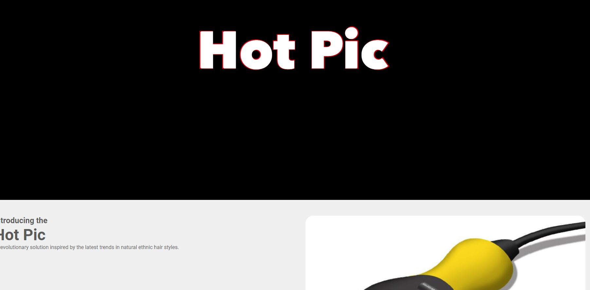

# Hot Pic

## Table of contents

- [Overview](#overview)
  - [The challenge](#the-challenge)
  - [Screenshot](#screenshot)
  - [Links](#links)
- [My process](#my-process)
  - [Built with](#built-with)
  - [What I learned](#what-i-learned)
  - [Continued development](#continued-development)
- [Author](#author)

## Overview

### The challenge

Users should be able to:

- View the optimal layout for the app depending on their device's screen size
- See the product detials and images

### Screenshot

### Links

- Live Site URL: [View](https://hotpic.netlify.app/)

## My process

- I developed this webpage specifically for my mother's product, the "Hot Pic," which offers innovative solutions for natural ethnic hair care.
- This project marks my inaugural solo venture in applying React skills that I've learned. It represents a significant milestone in my journey as a developer, showcasing the practical application of React concepts.
- React is utilized to build modular components for different sections of the webpage, enhancing reusability and maintainability.
- The Sections component dynamically renders sections based on data stored in the section array, allowing flexibility and scalability.
- SCSS (Sass) is used for styling, offering enhanced features like variables, nesting, and mixins to maintain consistency and manage complexity.

### Built with

- Semantic HTML5 markup
- [Bootstrap](https://getbootstrap.com/) - CSS library
- CSS custom properties
- [Sass](https://sass-lang.com/) - Preprocessor scripting language
- Flexbox
- Mobile-Responsive Design
- JavaScript - Scripting language
- [React](https://reactjs.org/) - JS library
- [Photoshop](https://www.adobe.com/products/photoshop.html) - Image editor

### What I learned

First React project I ventured on my own. I was impressed with myself how I reason with setting up the structure and remember what I learned in my lessons.

### Continued development

Will continue to improve it to from gained knowledge and client's request.

## Author

- Website - [Cameron Howze](https://camkol.github.io/)
- Frontend Mentor - [@camkol](https://www.frontendmentor.io/profile/camkol)
- GitHub- [@camkol](https://github.com/camkol)
- LinkedIn - [@cameron-howze](https://www.linkedin.com/in/cameron-howze-28a646109/)
- E-Mail - [cameronhowze4@outlook.com](mailto:cameronhowze4@outlook.com)
